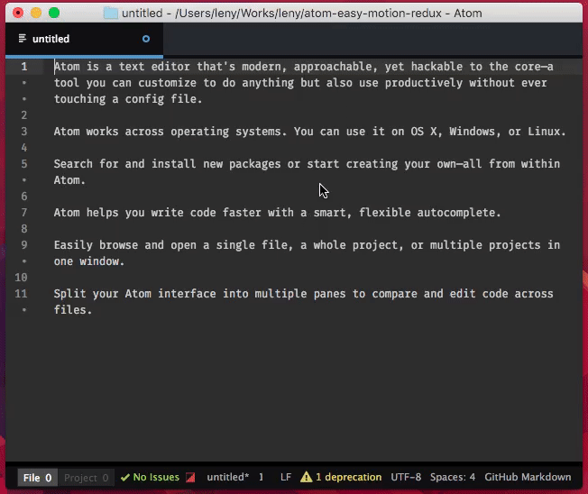
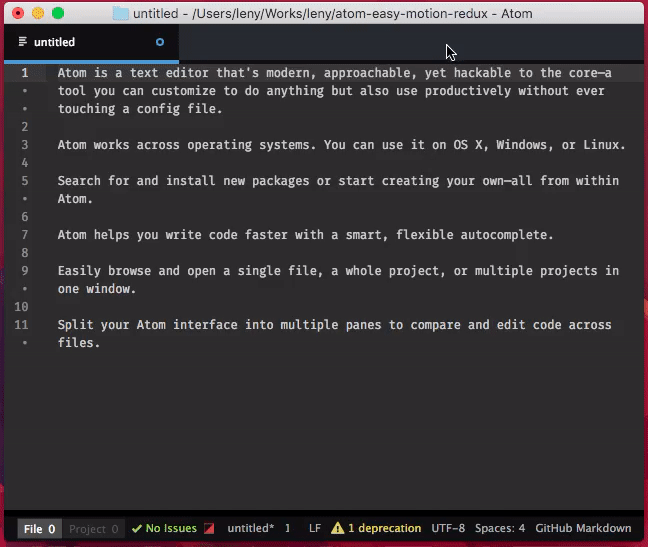
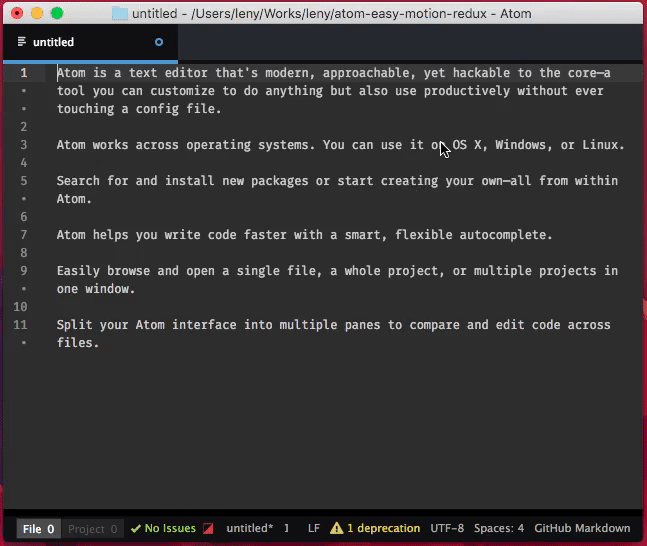

# atom easy-motion (redux) package

> MovementSpeed++. Jump to any word in your current view super fast.

* * *

**Note:** this package is a partial rewrite of the great [easy-motion package](https://github.com/adrian-budau/easy-motion) from Adrian Budau.

The original package seems dead and, with the deprecation of the atom API pre-1.0, it's sad that we can't use easy-motion in atom anymore. So, i rewrite the package, waiting for news from Adrian.

* * *

Check out that repository to better understand what this plugin does.

## Modes

By default the characters used for markers are **ABC....Z**. You can replace this if you want, also from settings.

### Jump to words

**Command:** `easy-motion-redux:words`  
Jump to words.

### Jump to letter

**Command:** `easy-motion-redux:letter`  
Jump to given letter.

### Jump to words starting by letter

**Command:** `easy-motion-redux:words_starting`  
Jump to words starting by given letter.

## Keybindings

With the success of Atom, it's really difficult to choose keybindings that will not enter in conflict whit anyone else's packages, so I have removed the default keystrokes and let the keymap empty to let you set your own keybindings.
